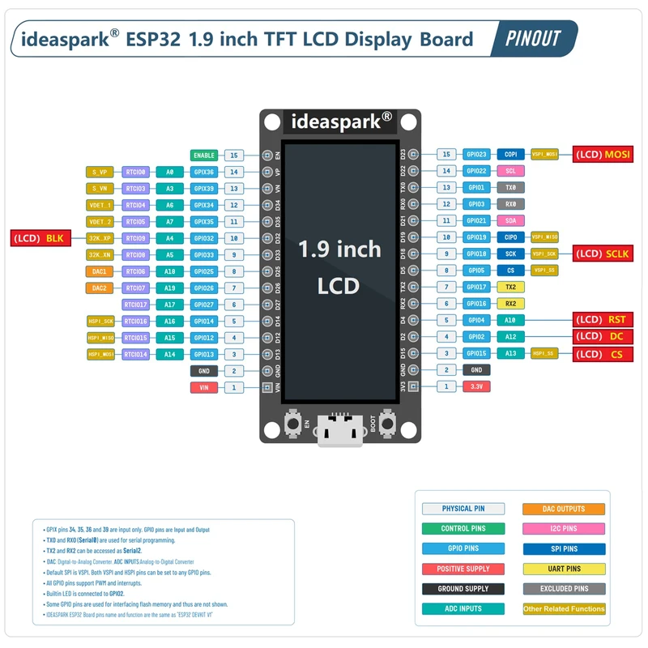
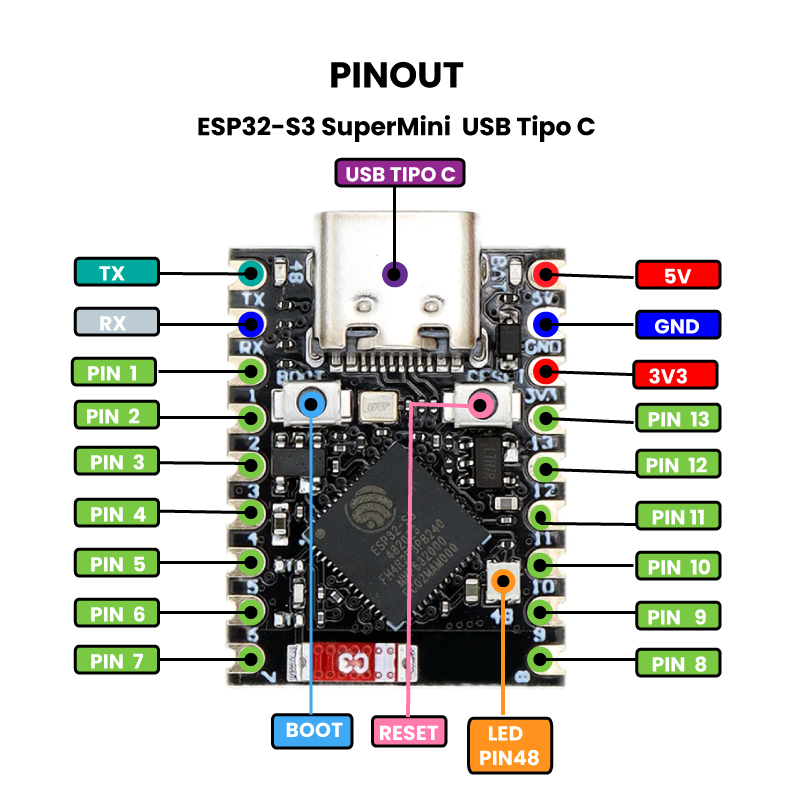

# Spartan Control Unit

## Project Overview

This is a C++ project for an ESP32 microcontroller using the PlatformIO framework. It's a control interface for accessory electronics embedded within a Spartan cosplay costume inspired by the Halo video game franchise.

## Features

- UI navigation via 3 momentary buttons for next, previous, and select actions
- Toggle cooling fans on and off
- Controlling the color, brightness, and display style of a pair of addressable LEDs
- Configuring a screensaver animation to play when idle
- Displaying one of several boot-up animation sequences
- Storing selected configuration to be loaded on next boot up
- Safety shutdown with visual warning if connection to interface is lost

## System Architecture

This project is designed to run on two separate ESP32 devices that communicate with each other. The same codebase is used for both devices, but it is compiled with different configurations based on the target device.

### Interface Device

*   **MCU:** ESP32 Dev Module with integrated TFT LCD
*   **Peripherals:** Three momentary push buttons for UI navigation (next, previous, select)
*   **Role:** This device acts as the user interface. It has a screen and buttons to control the system.

### Receiver Device

*   **MCU:** ESP32-S3 Super Mini
*   **Peripherals:** Addressable LEDs and a 5V DC fan (controlled via a transistor)
*   **Role:** This device receives commands from the Interface Device to control the LEDs and fan.

### Communication & Safety Shutdown

The Interface and Receiver communicate via ESP-NOW, a low-latency wireless protocol. To ensure safe operation, the system implements a heartbeat/watchdog mechanism:

*   **Heartbeat:** The Interface sends its current state to the Receiver every 5 seconds, even when the user isn't actively changing settings.
*   **Watchdog:** If the Receiver doesn't receive any messages for 10 seconds, it assumes connection is lost and triggers a safety shutdown.

**Safety Shutdown Sequence:**

1.  Fans are turned off immediately
2.  LEDs flash bright red for 5 seconds (warning phase)
3.  LEDs fade from bright red to off over 5 seconds
4.  Onboard LED stays red to indicate timeout state

This ensures that if the Interface device loses power, crashes, or goes out of range, the Receiver won't leave fans running or LEDs on indefinitely.

**Timing Configuration:**

These values can be adjusted in `include/layout.h`:

```cpp
#define HEARTBEAT_INTERVAL_MS 5000      // How often interface sends state
#define RECEIVER_TIMEOUT_MS 10000       // How long before safety shutdown
#define SHUTDOWN_FLASH_DURATION_MS 5000 // Red flashing duration
#define SHUTDOWN_FLASH_INTERVAL_MS 200  // Flash toggle rate
#define SHUTDOWN_FADE_DURATION_MS 5000  // Fade to black duration
```

## First-Time Setup: Device Pairing

Before the devices can communicate, you need to perform a one-time setup to "pair" them. The setup firmware automatically discovers and saves the MAC addresses to persistent storage.

### 1. Upload Setup Firmware

Build and upload the special setup firmware to each device:

*   **Interface Device:**
    ```bash
    pio run -e esp32dev-interface-setup --target upload
    ```
*   **Receiver Device:**
    ```bash
    pio run -e esp32-s3-supermini-receiver-setup --target upload
    ```

### 2. Pair the Devices

1.  Power on both devices.
2.  The **Interface Device** screen will display its own MAC address and wait for the receiver.
3.  The **Receiver Device** will broadcast its MAC address every 2 seconds.
4.  When the Interface receives the Receiver's MAC, it will:
    - Display both MAC addresses on screen
    - Automatically save both addresses to persistent storage
    - Show "Addresses saved!" confirmation
5.  Once you see the confirmation, pairing is complete.

### 3. Upload Operational Firmware

Upload the normal firmware to both devices:

*   **Interface Device:**
    ```bash
    pio run -e esp32dev --target upload
    ```
*   **Receiver Device:**
    ```bash
    pio run -e esp32-s3-supermini --target upload
    ```

The devices will automatically load the saved MAC addresses on boot. If no saved addresses are found, the Interface will display a warning prompting you to run the setup firmware.

### Re-Pairing Devices

To pair with different hardware, simply repeat the setup process. The new MAC addresses will overwrite the previously saved ones.

## Hardware

- Ideaspark ESP32 1.9" TFT LCD Display
- 3 momentary buttons
- 2 Addressable LEDs in series
- 2 3010 DC 5v fans

### Pinout




### Wiring

Here are the suggested connections for the accessories.

#### Momentary Buttons

For each button, a 10k Ohm pull-down resistor is required.

*   **Button 1 (Next):**
    *   Connect one leg to **3.3V**.
    *   Connect the other leg to **GPIO12**.
    *   Connect a 10k Ohm resistor from **GPIO12** to **GND**.
*   **Button 2 (Select):**
    *   Connect one leg to **3.3V**.
    *   Connect the other leg to **GPIO13**.
    *   Connect a 10k Ohm resistor from **GPIO13** to **GND**.
*   **Button 3 (Previous):**
    *   Connect one leg to **3.3V**.
    *   Connect the other leg to **GPIO14**.
    *   Connect a 10k Ohm resistor from **GPIO14** to **GND**.

#### LEDs (Addressable)

*   **Data Pin:** Connect to `GPIO8` on the ESP32-S3.
    *   **Note:** Since the addressable LEDs are 5V and the ESP32's GPIOs are 3.3V, a logic level shifter is recommended between `GPIO8` and the LED data pin to ensure reliable data transmission.
*   **Power:** Connect the LED strip's 5V pin to an external 5V power supply.
*   **Ground:** Connect the LED strip's GND pin to the same ground as the ESP32 and the 5V power supply.

#### Fans (5V)

To control the 5V fans, you'll need a transistor (like a MOSFET) for each fan, as the ESP32's GPIO pins cannot provide enough power.

*   **Fan 1 Control:** `GPIO7`
*   **Fan 2 Control:** `GPIO27`

##### Wiring with N-Channel MOSFETs (for each fan):

1.  Connect the **Gate** of the MOSFET to the GPIO pin (e.g., `GPIO7`).
2.  Connect the **Source** of the MOSFET to Ground (GND).
3.  Connect the **Drain** of the MOSFET to the negative (black) wire of the fan.
4.  Connect the positive (red) wire of the fan to the 5V power supply.

## Project Structure

-   `src/main.cpp`: The main entry point of the application. It initializes the display and calls the animation functions.
-   `src/unsc_logo.cpp` and `include/unsc_logo.h`: These files contain the bitmap data for the UNSC logo and the function to display and scroll it.
-   `src/loading_animations.cpp` and `include/loading_animations.h`: These files contain several different loading animations that can be used in the boot sequence.
-   `platformio.ini`: The PlatformIO configuration file, which specifies the board, framework, and library dependencies.

## Building and Running

This project is built and managed using PlatformIO.

-   **Build:** To build the project, use the command `pio run`.
-   **Upload:** To upload the compiled firmware to the ESP32 board, use the command `pio run --target upload`.
-   **Monitor:** To view the serial output from the board, use the command `pio device monitor`.

### Compiling for a specific device

The `platformio.ini` file has two environments defined:

*   `esp32dev`: Builds the firmware for the **Interface Device**. It sets the `DEVICE_MODE` build flag to `DeviceMode::INTERFACE`.
*   `esp32-s3-supermini`: Builds the firmware for the **Receiver Device**. It sets the `DEVICE_MODE` build flag to `DeviceMode::RECEIVER`.

To build for a specific device, you can use the `-e` flag with the PlatformIO CLI. For example:

*   Build for Interface Device: `pio run -e esp32dev`
*   Build for Receiver Device: `pio run -e esp32-s3-supermini`

## Configuration

Most configurable values are centralized in `include/layout.h`. This makes it easy to customize the system without searching through code.

### Display & Menu Layout

```cpp
#define SCREEN_WIDTH 320           // Display width in pixels
#define SCREEN_HEIGHT 170          // Display height in pixels
#define MENU_BTN_HEIGHT 35         // Menu button height
#define MENU_BTN_RADIUS 6          // Button corner radius
#define MENU_BTN_GAP 7             // Space between buttons
#define MENU_VIEWPORT_SIZE 4       // Visible menu items before scrolling
#define SIDEBAR_WIDTH 85           // Right sidebar width
```

### LED Settings

```cpp
#define BRIGHTNESS_LEVELS 4        // Number of brightness steps (1-4)
#define MAX_BRIGHTNESS 255         // Maximum LED brightness
#define FLASH_INTERVAL_MS 500      // Flash mode toggle rate
#define STROBE_INTERVAL_MS 100     // Strobe mode toggle rate
```

### Communication & Safety

```cpp
#define HEARTBEAT_INTERVAL_MS 5000      // Interface state broadcast interval
#define RECEIVER_TIMEOUT_MS 10000       // Watchdog timeout before safety shutdown
#define SHUTDOWN_FLASH_DURATION_MS 5000 // Red warning flash duration
#define SHUTDOWN_FLASH_INTERVAL_MS 200  // Warning flash toggle rate
#define SHUTDOWN_FADE_DURATION_MS 5000  // Fade to black duration
```

## Development

### Hardware Verification

To assist with wiring and debugging, a hardware verification function is included in the project. This function (`verifyHardwareConnections()`) guides you through checking the connections of the buttons and will be expanded to include other hardware components as they are integrated.

You can enable or disable this feature by modifying the `VERIFY_HARDWARE` boolean flag at the top of `src/main.cpp`:

```cpp
const bool VERIFY_HARDWARE = true; // Set to false to skip hardware verification
```

### Development Conventions

The code is written in C++ and follows the Arduino framework conventions. The code is organized into separate files for different functionalities, which is a good practice for embedded projects. The use of header files helps to keep the code modular and easy to maintain.

There are no specific linting or formatting rules defined in the project, but the code is well-formatted and easy to read.

Any ui/navigation code should be configuration-driven, allowing additional views, menu items, etc to added easily.
